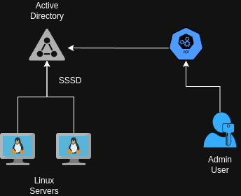
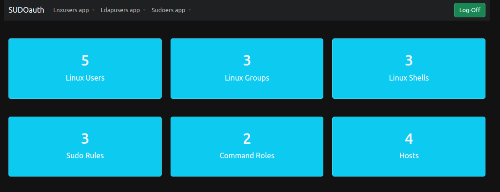
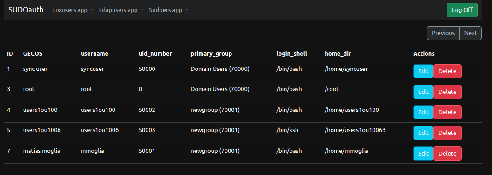
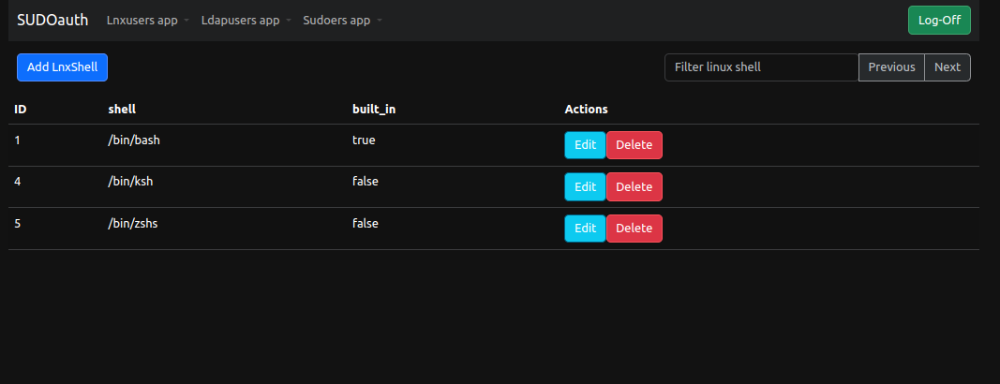
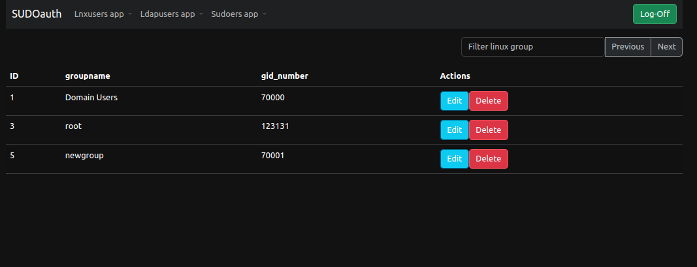
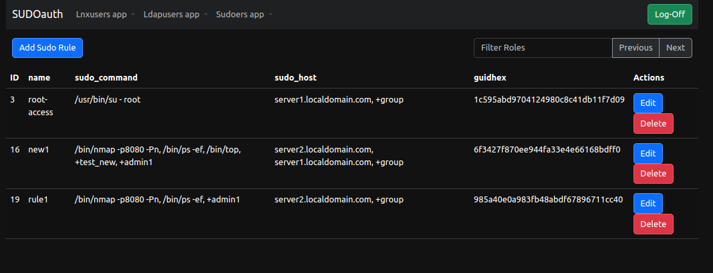
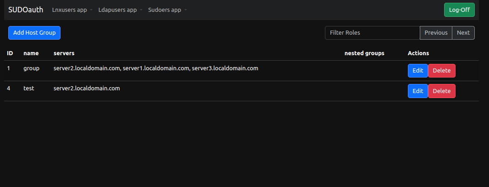
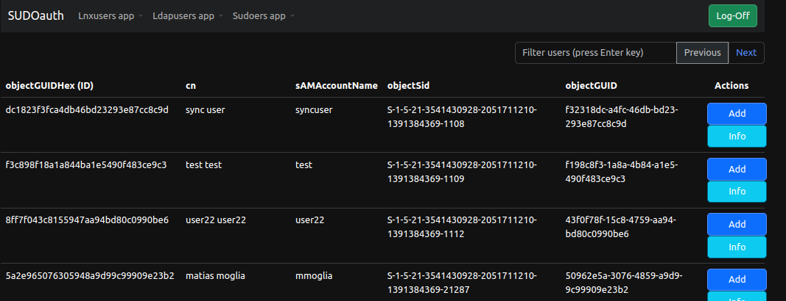
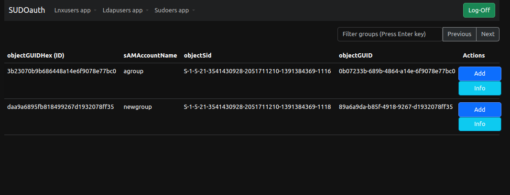
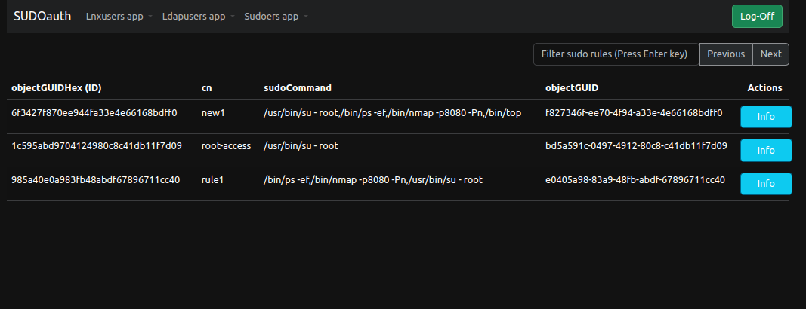

# Sudoauth

A framework to handle sudo rules and user/groups attributes in Active Directory at scale.

## Design

## Dashboard

### Linux users + shells

### Linux groups

### Sudo Rules / Roles

### Netgroups

### Active Directory users

### Active Directory groups

### Active Directory sudo rules

